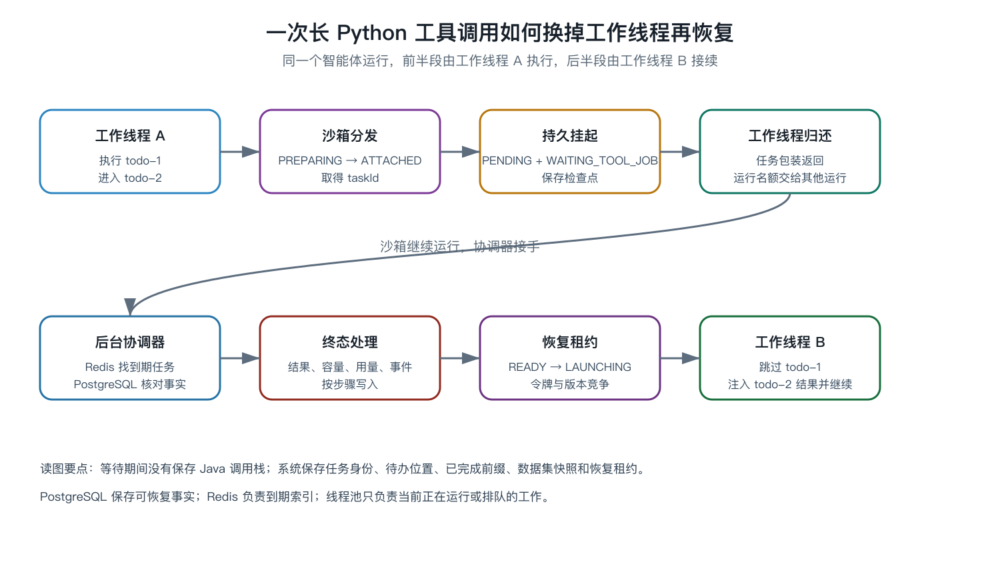
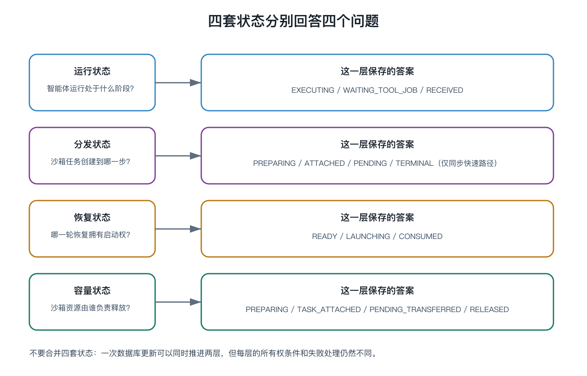

# 智能体长工具等待与可恢复调度：八个文件入门长教程

日期：2026-07-17
源码基线：`2e463aa290a17c01eec45d229162db3952a42e6f`

这篇教程写给刚开始阅读 Java 后端代码的同学。你不需要先懂 LangChain4j、Redis 脚本或 PostgreSQL 的 JSONB。我们只追踪一件具体的事：一个智能体调用耗时较长的 Python 沙箱任务时，怎样暂时离开 Java 工作线程，等沙箱完成后再从原位置继续。

全文只要求你仔细阅读八个源码文件。每一节先说明文件为什么存在，再带你找到入口方法，随后把它放回一次完整调用中。遇到枚举、比较并交换、幂等、租约等术语时，都会先用普通语言解释。

## 1. 先了解用户经历了什么

用户提出一个请求：

> 读取某只基金和比较指数近一年的数据，用 Python 计算最大回撤，再解释两者差异。

规划器把请求拆成三个待办节点：

```text
todo-1：读取基金和指数数据
todo-2：调用 executePython 计算最大回撤
todo-3：解释 Python 结果
```

`todo-1` 很快结束。`todo-2` 把代码和数据交给独立的 Python 沙箱。沙箱创建后台任务后返回 `taskId`，计算还要继续几十秒。

最直接的写法是让 Java 线程一直查询：完成了吗？完成了吗？这种写法能够完成一个请求，却会在并发增加后浪费有限资源。Java 线程在等待，调度器仍把这个智能体运行计为运行中。假设运行名额只有 20，20 个长任务就能让后来到达的短请求全部排队。

AlphaFrog 选择另一条路径。Java 线程把恢复所需事实写入 PostgreSQL，然后结束当前 `Runnable`。后台协调器继续观察沙箱。终态出现后，它把运行重新放进同一个有界调度器。后半段可以由同实例或另一实例的工作线程执行。

Oracle 的 [`ThreadPoolExecutor` 文档](https://docs.oracle.com/en/java/javase/26/docs/api/java.base/java/util/concurrent/ThreadPoolExecutor.html) 说明了工作线程、任务队列和拒绝策略怎样共同限制并发资源。Temporal 的 [Workflow Execution](https://docs.temporal.io/workflow-execution) 说明了持久执行在进程失败后继续推进的通用目标。AlphaFrog 没有接入 Temporal，也没有复制其事件历史重放；这里引用它，是为了帮助你理解“等待期间释放计算资源，恢复事实另行持久化”这一工程动机。

这里的“恢复”不是把旧 Java 栈帧冻结后搬走。旧方法调用已经结束。系统保存的是业务执行现场：运行编号、沙箱任务编号、挂起待办节点、已经完成的待办前缀、数据集映射、终态结果以及恢复所有权。



## 2. 贯穿全文的四个编号

为了避免在类名之间迷路，后面一直使用四个假编号：

- `run-42` 是整次智能体运行；
- `todo-2` 是调用 Python 的待办节点；
- `call-7` 是该节点中的工具调用；
- `task-99` 是 Python 沙箱创建的后台任务。

它们不是同一个编号。`run-42` 回答“哪个用户运行”，`todo-2` 回答“计划执行到哪一步”，`call-7` 回答“哪次模型工具调用”，`task-99` 回答“外部沙箱中的哪项工作”。恢复协议需要同时校验多个身份，正是因为其中任意一个都不足以唯一描述整件事。

## 3. 四套状态各自回答一个问题

初学者容易看到很多状态后试图把它们排成一条长链。这样阅读会产生矛盾。例如运行可以处于 `RECEIVED`，外部任务分发事实仍是 `PENDING`，恢复交接却已经是 `READY`。这不是状态错乱，因为三者回答的问题不同。

运行状态回答用户流程处在哪一段。常见值包括 `EXECUTING`、`WAITING_TOOL_JOB` 和 `RECEIVED`。

分发状态回答沙箱创建到哪一步。`PREPARING` 表示创建请求之前已经保存操作身份，`ATTACHED` 表示已经得到 `taskId`，`PENDING` 表示当前 Java 执行者已把轮询责任交给后台。

恢复状态回答谁有权启动后半段。`READY` 表示可以竞争，`LAUNCHING` 表示某个带令牌的执行者已经取得租约，`CONSUMED` 用于描述结果已被工作流接收的语义。

容量状态回答沙箱资源由谁负责释放。它会经历 `PREPARING`、`TASK_ATTACHED`、`PENDING_TRANSFERRED`、`TERMINAL_CONFIRMED` 和 `RELEASED`。



阅读任何一次状态更新时，先问“它保护的对象是什么”。若保护用户运行，它属于运行状态；若保护恢复启动权，它属于恢复状态。把这个问题问清楚，后面的 SQL 条件就容易理解。

### 3.1 阅读源码前会遇到的几个词

“类”是一组数据和行为的定义，例如 `ToolJobResumeService`；“接口”只约定调用形式，例如 `PythonSandboxDispatchStore`，具体数据库实现可以放在另一个模块。

“DTO”是数据传输对象。它主要承载字段，本身很少决定业务流程。`ToolJobAnchor` 和 `ToolJobResumeContext` 都有这种特征，但前者会持久化，后者只服务于一次恢复启动。

“数据库映射层”是 Java 方法与 SQL 的连接层。`AgentRunMapper.java` 声明方法，`AgentRunMapper.xml` 提供 SQL。并发所有权能否成立，要以 XML 中真正执行的 `WHERE` 为准。

“CAS”在本文表示比较后更新。调用方提供预期旧状态与版本；旧条件仍成立时更新一行，否则更新零行。零行是一种正常竞争结果，不等同于数据库故障。

“`Runnable`”是一段交给线程池执行的代码。它返回时，Java 调用栈已经结束。恢复时会创建新的 `Runnable`，不会唤醒旧调用栈。

“线程本地变量”只在当前线程附近有效。旧工作线程退出后，`AgentContext` 和数据集登记表不能依靠线程本地变量保存，因此挂起前需要生成持久快照。

## 4. 文件一：`ToolJobAnchor.java` 保存跨线程事实

路径：

`agentPlatformShared/src/main/java/world/willfrog/agent/platform/dataanalysis/ToolJobAnchor.java`

### 4.1 为什么先阅读数据类

很多人习惯先查找入口方法。这个专题更适合先阅读 `ToolJobAnchor`，因为它列出了系统承诺保存的全部事实。旧工作线程结束后，局部变量都会消失。能够被新进程重新读取到的内容，才有资格参与恢复。

`ToolJobAnchor` 会被序列化到 `AgentRun.toolJobAnchorJson`。可以把它想成贴在 `run-42` 数据库记录上的一张交接单。交接单不是日志摘要，它必须支持下一位执行者做出确定判断。

### 4.2 第一组字段：外部操作身份

先查找 `operationId`、`requestFingerprint` 和 `taskId`。

`operationId` 在调用 `createTask` 之前生成。若 RPC 超时，调用方不知道请求是没有送达，还是沙箱已经创建任务但响应丢失。此时不能盲目再创建一次。调用方使用同一个 `operationId` 查询沙箱，找到已经创建的任务后继续。

`requestFingerprint` 是创建参数的稳定摘要。查询到相同 `operationId` 时，还要检查请求指纹是否一致。否则一次旧操作编号可能错误地指向不同代码或不同数据集。

`taskId` 是沙箱确认创建后返回的外部编号。在 `PREPARING` 阶段它可能为空；进入 `ATTACHED` 后必须存在。

接着查找 `toolCallId` 和 `attempt`。它们标识智能体一侧逻辑调用的第几次尝试。`operationId` 与 `taskId` 关注外部系统，`toolCallId + attempt` 关注模型工具调用。这些字段保存了外部操作身份，但当前异步完成器使用的宽更新只检查运行编号与旧状态，没有同时检查全部身份字段。旧完成器是否可能覆盖同一运行的新等待任务，仍是需要补强的条件更新风险。

### 4.3 第二组字段：工作流执行位置

`todoId` 保存当前挂起的待办节点，本例是 `todo-2`。`sequence` 保存待办节点顺序。`completedTodosJson` 保存已经完成的前缀，本例至少包含 `todo-1`。

为什么不能只保存 `todoId=todo-2`？因为恢复后需要知道 `todo-1` 是否应再次执行。如果 `todo-1` 会读取数据、扣减配额或写事件，重复执行会引入新的副作用。保存完成前缀后，恢复执行器才能跳过它。

`toolCallsUsed` 记录恢复前已经使用的工具调用数量。模型工具预算通常属于整次运行。恢复不应把预算重置成零，否则一次挂起就能绕过限制。

### 4.4 第三组字段：数据集现场

`datasetSnapshotJson` 保存运行内数据集登记表，`datasetSnapshotDigest` 保存摘要，`datasetRefsJson` 保存相关引用。

`todo-1` 读取行情后，工具结果可能只向模型暴露一个较短的数据集编号。真正的数据集路径与元数据保存在运行上下文中。旧 Java 对象销毁后，新工作线程若只取得 `todo-2` 和 Python 结果，可能无法理解原数据集编号。

因此挂起时要拍摄数据集登记表快照，恢复时重新注册。检查点写入服务会配对校验快照与摘要；当前恢复入口解析快照后直接恢复登记表，没有再次比较 `datasetSnapshotDigest`。摘要主要保护检查点保存时的逻辑身份，不能自动证明恢复入口已经复核摘要，更不能证明外部文件字节永远没有变化。

### 4.5 第四组字段：终态与完成进度

`terminalStatus`、`terminalResultPreview`、`terminalRawRef` 和 `terminalRetryable` 保存沙箱终态的规范化结果。结果很大时，预览供工作流快速理解，`rawRef` 指向完整材料。

`finalizerStep` 保存后台完成器已经走到哪一步。为什么需要它？终态处理不是一次数据库写入。它还要释放容量、记录用量、发布事件、推进运行状态并准备恢复。进程可能在任何两步之间退出。`finalizerStep` 让下一次扫描从未完成步骤继续。

### 4.6 第五组字段：恢复所有权

`resumeState`、`resumeToken`、`resumeLeaseVersion` 和 `resumeClaimedAt` 共同描述恢复租约。

`resumeToken` 可以理解为本轮执行者的身份证。`resumeLeaseVersion` 是不断递增的轮次。即使状态从 `LAUNCHING` 回滚到 `READY`，版本也不能退回旧值。否则一位持有旧令牌的慢执行者可能在稍后重新获得写入资格，这类问题常被称为 ABA。

`resultConsumed` 说明 Python 终态是否已经注入工作流。它与“沙箱任务成功”不是一回事。沙箱成功只说明外部计算结束；结果消费说明 `todo-2` 已经接收结果，并且继续位置已经向后推进。

### 4.7 阅读完这个文件应当得到什么

此时不需要记住全部字段。你只要能回答：如果旧工作线程现在退出，新进程至少需要哪些事实？答案应包括外部任务身份、挂起节点、完成前缀、数据集快照、终态处理进度和恢复租约。

下一文件会回答：这些字段怎样在多个实例竞争时安全更新。

## 5. 文件二：`AgentRunMapper.xml` 把所有权写进 SQL

路径：

`agentPlatformShared/src/main/resources/mapper/AgentRunMapper.xml`

### 5.1 为什么“先查询再修改”不够

假设实例 A 和实例 B 同时读到 `resumeState=READY`。两者在 Java 中都判断“可以恢复”，随后都发起更新。如果 SQL 只按 `run_id` 更新，两个实例都可能认为自己成功。

调用方刚才读到的值只能作为候选。提交更新的这一刻，数据库中的旧条件仍然成立，更新才有资格成功。因此映射文件中的重要语句会把预期旧状态、令牌、版本和操作身份放进 `WHERE`。

简化后的形状如下：

```sql
update agent_run
set tool_job_anchor_json = :newAnchor
where id = :runId
  and resume_state = :expectedState
  and resume_token = :expectedToken
  and resume_lease_version = :expectedVersion
```

若受影响行数为 1，本次更新取得所有权。若为 0，说明至少一个预期条件已经变化，调用方需要重新读取，而不能继续使用旧快照。

PostgreSQL 的 [Transaction Isolation](https://www.postgresql.org/docs/current/transaction-iso.html) 解释了并发更新在 `Read Committed` 下怎样重新检查更新后的行。项目仍需自己把预期状态和版本放进 `WHERE`，并检查受影响行数；数据库隔离级别不会自动理解“谁拥有恢复租约”这一业务规则。

### 5.2 第一个重要映射：创建前认领

查找 `claimPreparingToolJobAnchor`。它只在运行状态允许且旧锚点为空时写入 `PREPARING`。

这一步必须发生在沙箱 `createTask` 之前。若先创建任务再写入数据库，进程刚好在两者之间退出，系统会留下一个真实运行的沙箱任务，却找不到它属于哪次智能体运行。先写入 `operationId` 与指纹后，即使创建响应丢失，启动恢复仍有查询入口。

这一设计也解释了 `PREPARING` 的名字：外部任务尚未确认，系统先准备好了可追踪身份。

### 5.3 第二个重要映射：沿同一操作推进

查找 `updateActiveToolJobAnchor`。它使用 `operationId` 约束同一外部操作。`PREPARING` 获得 `taskId` 后变为 `ATTACHED`，随后可能进入 `PENDING`。

若旧回调携带不同 `operationId`，更新应返回零行。调用方不能把“数据库里有一个锚点”理解成“它就是我的锚点”。身份条件需要一直保留。

### 5.4 第三个重要映射：锚点和运行状态一起推进

查找 `updateToolJobAnchorAndStatusByOperation`。它在同一 SQL 更新中写入 `PENDING` 锚点，并将 `AgentRunStatus` 修改为 `WAITING_TOOL_JOB`。

把两者拆成两次提交会出现可见中间态。若先写入运行状态，后台看到等待中却没有完整锚点；若先写入锚点，另一个流程可能仍把运行当作普通 `EXECUTING`。同一条语句不能解决所有业务问题，但能消除这两个字段之间的事务窗口。

### 5.5 第四个重要映射：窄化检查点合并

查找 `updateToolJobCheckpoint`。检查点写入不会取得一份旧 `ToolJobAnchor` 覆盖整段 JSON。它校验任务身份与 `checkpointVersion`，只合并完成前缀、数据集快照、待办位置和相关恢复字段，然后递增版本。

为什么需要窄化合并？后台完成器可能同时写入终态字段。如果执行管线持有挂起瞬间的旧对象进行全量覆盖，可能把刚写入的 `terminalStatus` 清掉。只更新自己拥有的字段，可以减少并发覆盖面。

### 5.6 第五个重要映射：恢复租约

查找 `casUpdateAnchorResumeState`。CAS 是 compare-and-set 的缩写，即“比较旧值，条件成立才写新值”。这里比较 `resumeState`、令牌和版本，成功后把 `READY` 推进为 `LAUNCHING`。

多个后台实例都可能扫到 `run-42`。只有一个实例的更新返回 1。其他实例收到 0 后应停止本轮启动。租约过期重取时会生成新令牌并递增版本，旧实例之后完成也无法清理新实例的锚点。

查找 `clearToolJobAnchorWithToken` 可以看到同一思想：最终清理不仅按 `runId`，还要按当前令牌与版本。清理是一种破坏性写入，更需要证明调用者仍拥有这一轮交接。

### 5.7 两类扫描入口

`listActiveToolJobAnchors` 为启动恢复和后台协调提供活动锚点。`listResumeReadyAnchors` 查找已经完成终态处理、可竞争恢复或需要处理遗留租约的记录。

扫描只是候选发现，不授予所有权。两个实例读到同一候选是正常现象，真正的排他性来自后续条件更新。

当前查询范围也有限定条件。教程详细版会说明：终态处理在 `CAS_STATUS` 后、写入 `READY` 前退出，以及终态运行仍持有 `LAUNCHING` 锚点等组合，不能一概宣称都被 PostgreSQL 启动扫描覆盖。

### 5.8 初学者的阅读方法

阅读 XML 时，不要试图一次理解完整 JSONB 表达式。先标出三个位置：`SET` 写入了哪些字段，`WHERE` 检查哪些旧事实，调用方怎样处理受影响行数。再回到 Java 方法观察零行分支。这个顺序比从长 SQL 的第一个字符逐字翻译更有效。

## 6. 文件三：`LangchainRunConcurrencyScheduler.java` 管理运行名额

路径：

`agentLangchainService/src/main/java/world/willfrog/agentlangchain/orchestration/LangchainRunConcurrencyScheduler.java`

### 6.1 线程池和运行名额不是同一个概念

线程池提供工作线程，调度器提供智能体运行层面的准入规则。一个运行可能包含多次模型调用和工具调用。系统不希望所有请求无界进入线程池队列，因此在提交前维护运行中数量与有限等待队列。

先阅读 `reserve()`。它在同一把锁下决定四种结果：立即获得名额、进入有限队列、在配置允许时使用弹性名额、队列饱和后拒绝。统一锁让运行计数和队列变化保持一致视图。

### 6.2 `Reservation` 表达谁负责归还

入口取得名额后，仍可能在真正提交 `Runnable` 前失败。如果没有明确所有权，名额可能泄漏。`Reservation` 用状态转换表达责任。

在激活之前，入口调用者负责关闭预留；激活之后，责任转给执行包装层。这个小对象很重要，因为并发资源泄漏往往发生在“已经记账但尚未启动”的夹缝中。

### 6.3 `submitRunning()` 的 `finally`

继续阅读 `submit()` 和 `submitRunning()`。后者包装真正任务，大意是：

```java
try {
    task.run();
} finally {
    onRunFinished();
}
```

无论任务正常返回还是抛出异常，`onRunFinished()` 都会执行。它递减运行中数量，再从队首提升等待任务。

长工具挂起为何能释放名额？因为挂起信号被执行管线识别后，当前 `Runnable` 会结束。沙箱仍在外部运行，但 Java 调度器只关心当前智能体执行片段是否还占用工作线程。`finally` 随后归还名额。

### 6.4 恢复任务为什么还要重新排队

沙箱完成后，`run-42` 不会绕过调度器直接创建线程。恢复启动器仍调用同一个提交入口。这保证新请求和恢复请求都受有界并发约束。

这也意味着终态出现不等于后半段立即执行。若队列忙，恢复任务可以等待。PostgreSQL 已经保存终态与租约，等待不会丢失业务事实。

### 6.5 一个容易误读的点

执行管线返回 `suspended` 结果时，从线程池角度它是一次正常结束。不要把“正常返回”理解成整次智能体运行完成。这里完成的只是当前执行片段。数据库运行状态仍是 `WAITING_TOOL_JOB`，后续片段尚未开始。

## 7. 文件四：`PythonSandboxTools.java` 决定同步完成还是持久挂起

路径：

`agentToolsShared/src/main/java/world/willfrog/agent/tools/python/PythonSandboxTools.java`

### 7.1 从公开工具入口开始

先查找 `executePython()`，再跟进 `executePythonInternal()` 与数据密集型分支。公开入口要完成参数校验、运行上下文读取和普通工具返回包装。真正的长任务协议位于数据密集型执行路径。

本例中，`todo-2` 调用 `executePython`。系统估算代码与数据需要的沙箱容量，并先申请预留。容量预留不是线程池名额，它代表沙箱侧 CPU、内存或并发任务资源。

### 7.2 创建任务前先保存 `PREPARING`

工具根据 `run-42`、`call-7` 和尝试次数生成稳定 `operationId`，随后将规范化请求计算为 `requestFingerprint`。随后调用数据库服务写入 `PREPARING`。

顺序必须是：

```text
保存 PREPARING
调用沙箱 createTask
保存 taskId 与 ATTACHED
```

若 `createTask` 返回超时，代码使用 `operationId` 查询已创建任务。查到后还要核对指纹。这样可以处理“任务已创建，响应在网络中丢失”的不确定结果。

### 7.3 为什么还保留短暂快速路径

并非所有 Python 任务都很长。若沙箱几百毫秒内结束，立即取得结果比经历完整挂起与恢复更省成本。因此得到 `taskId` 后会有一段快速查询窗口。

快速路径取得终态时，工具在当前调用中完成容量释放、结果包装和返回，`todo-2` 无需切换工作线程。快速窗口到期只说明“现在还没完成”，不能把任务标记为失败。

### 7.4 `suspend()` 完成责任交接

快速路径未取到终态时进入 `suspend()`。它先把容量责任从当前工具调用转给后台协调流程，容量状态进入 `PENDING_TRANSFERRED`。随后数据库在同一更新中保存 `PENDING` 锚点并将运行修改为 `WAITING_TOOL_JOB`。

最后抛出 `ExternalToolJobPendingException`。这个类名带有 `Exception`，但在协议内它是控制信号：告诉上层不要把工具调用包装成失败文本，也不要继续执行 `todo-3`。

若上层把它当普通异常吞掉，模型可能收到“工具执行失败”，随后重试并创建第二个任务。后面的工作流文件专门保证该信号可以穿过工具调用层。

### 7.5 容量为什么要先转交再挂起

当前线程即将退出，不能继续承担未来释放责任。`PENDING_TRANSFERRED` 表示后台终态处理者接管。以后 `ToolJobFinalizer` 获得终态证明，随后将容量推进为已确认并释放。

若进程在转交后退出，容量预留与外部任务身份仍保存在锚点。启动恢复能够继续。若只修改内存中的计数，进程退出后资源账本无法重建。

### 7.6 到这里发生了什么

`run-42` 已经拥有 `task-99`。运行状态是 `WAITING_TOOL_JOB`，分发事实是 `PENDING`，容量责任已经交给后台。当前 Java 调用栈尚未完全退出，因为上层仍需保存工作流检查点。

这正是下一个文件的职责。

## 8. 文件五：`LangchainLinearRunPipelineImpl.java` 保存可继续执行的位置

路径：

`agentLangchainService/src/main/java/world/willfrog/agentlangchain/orchestration/LangchainLinearRunPipelineImpl.java`

### 8.1 执行管线位于调度器与工作流之间

调度器只知道有一个 `Runnable`。工作流执行器知道待办节点和工具调用。执行管线把两者连接起来：首次执行从 `launchAsync()` 进入，恢复执行从 `launchResumedAsync()` 进入，两者最终都要提交到有界调度器。

先阅读首次执行路径。`launchAsync()` 负责准入和异步提交，真正业务位于 `executeRun()`。它准备运行上下文、读取计划、调用线性工作流执行器，再根据 `LangchainLinearWorkflowResult` 决定完成、失败或挂起。

### 8.2 挂起结果怎样到达管线

`PythonSandboxTools.suspend()` 抛出控制信号后，工具调用层不能把它改造成普通失败。`LangchainTodoNodeExecutor` 与 `LangchainLinearWorkflowExecutor` 会把它逐层转换成“当前待办节点挂起”的结果，最终 `executeRun()` 看到 `isSuspended()`。

这一刻，数据库已经保存 `task-99` 和 `WAITING_TOOL_JOB`，但还不能让 `Runnable` 返回。管线必须保存工作流位置。

### 8.3 `persistToolJobCheckpoint()` 保存什么

方法首先重新读取数据库中的最新锚点，不再使用工具调用开始前的旧对象。重新读取很重要，因为 `PythonSandboxTools` 已经推进了分发状态和容量责任。

随后它构造检查点请求，包含：

- 已完成待办前缀，本例是 `todo-1`；
- 挂起节点，本例是 `todo-2`；
- 当前工具调用计数；
- 数据集登记表快照和摘要；
- 与 `task-99` 对应的操作身份；
- 预期 `checkpointVersion`。

`ToolJobCheckpointWriter.captureAndSave()` 负责真正的捕获与条件写入。写入成功后，管线发布 `TOOL_CALL_SUSPENDED` 事件，随后返回挂起结果。

### 8.4 为什么事件要晚于检查点

事件消费者可能看到“运行已经挂起”后立即查询数据库。若先发布事件再写入检查点，消费者会读取到不完整现场。这里选择先保存事实，再发布通知。

事件发布失败如何处理取决于调用链的具体错误策略，但事件不能反过来成为工作流事实源。恢复所需内容仍以 PostgreSQL 锚点为准。

### 8.5 检查点失败不能伪装成安全挂起

假设数据库在写检查点时失败。此时运行已经是 `WAITING_TOOL_JOB`，但完成前缀或数据集快照不完整。管线调用 `recordCheckpointFailure()`，交给 `ToolJobCheckpointFailureRecoveryService` 尝试取得失败处置权，或确认另一个并发写入者已经保存更高版本。

若结果表明失败已由某个持久处理者接管，当前线程可以结束。若结果是 `UNOWNED`，只能说明补偿没有建立明确所有者。当前实现仍会让执行片段返回，因此教程不能把每次检查点失败都描述成“已经安全托管”。这是需要继续收紧的窗口。

### 8.6 `Runnable` 何时真正归还名额

管线保存检查点并返回后，控制流回到 `LangchainRunConcurrencyScheduler.submitRunning()` 的包装层。`finally` 调用 `onRunFinished()`，`run-42` 不再占用运行名额。

从用户角度，运行仍在等待；从 Java 线程池角度，这个执行片段已经结束；从沙箱角度，`task-99` 仍在计算。这三个观察同时成立。

### 8.7 恢复入口准备什么

终态到达后，`launchResumedAsync()` 会再次进入调度器。获得名额后，`executeResumedRun()` 重新读取 `AgentRun`，恢复运行上下文、模型配置、原计划、数据集登记表和恢复上下文。

它不会继续使用旧 Java 对象，也不会让模型重新规划。当前恢复只支持线性工作流。遇到 DAG 计划时会返回明确的不支持结果，因为随意猜测分支完成情况可能重复执行副作用。

## 9. 文件六：`ToolJobFinalizer.java` 把终态处理拆成可重入步骤

路径：

`agentLangchainService/src/main/java/world/willfrog/agentlangchain/tooljob/ToolJobFinalizer.java`

### 9.1 沙箱成功后还没有完成恢复

假设后台协调器查询 `task-99`，沙箱返回 `SUCCEEDED`。系统仍要完成多项动作：验证结果、保存终态、释放容量、记用量、发事件、推进运行状态并创建恢复租约。

若把这些动作写成一个很长方法，却不保存中间进度，进程在第五步退出后只能从第一步重来。重复释放容量、重复记用量或重复发事件都会造成问题。

`ToolJobFinalizer` 用 `finalizerStep` 把流程分成六个阶段：

```text
ENVELOPE → RELEASE → USAGE → EVENT → CAS_STATUS → RESUME_READY
```

每完成一步，就把新进度写回锚点。下次收到同一终态时，方法读取进度，从尚未完成的阶段继续。

### 9.2 `ENVELOPE`：先形成稳定终态信封

第一步把沙箱原始响应规范化为项目内部终态。它保存状态、结果预览、完整结果引用、实际资源用量和 `retryable` 分类。

为什么先保存信封？后面释放容量与决定恢复都需要同一份终态证明。若每次都重新解释外部响应，不同版本代码可能得出不同结论。

`ToolJobResultValidator` 会检查 `taskId`、先前确认的终态和结果正文完整性。它不校验运行编号、操作编号、工具调用编号或尝试次数。缺少必要的 `retryable` 分类时，完成器不会贸然释放容量，因为系统还没有完整回答失败是否允许重试。

### 9.3 `RELEASE`：用终态证明释放容量

外部任务结束后，后台处理者承担容量释放责任。释放接口要接受“本次释放成功”与“之前已经释放”两种可接受结果。

第二种结果不是错误。假设进程完成释放后、写入 `finalizerStep` 前退出，下一轮必然再次调用释放。若资源账本按稳定操作身份去重，`ALREADY_RELEASED` 可以安全地向前推进。

### 9.4 `USAGE`：按稳定身份记账

用量记录不能简单按每次方法调用增加。可重入意味着同一步可能执行多次。`ToolJobUsageHookImpl` 应使用稳定去重身份，使同一沙箱任务只产生一份有效记账。

完成器在确认用量持久化后推进步骤。若记账暂时失败，运行仍保持可扫描状态，下一轮继续。

### 9.5 `EVENT`：通知而不承担事实源职责

终态事件帮助前端或审计流程知道 `task-99` 已结束。事件也需要稳定去重键。否则进程重启会让用户看到多次完成通知。

即使事件系统暂时不可用，终态信封仍保存在 PostgreSQL。事件恢复依赖持久事实；持久事实不依赖某一次消息发送。

### 9.6 `CAS_STATUS`：将运行从等待状态转换为可恢复状态

完成器使用条件更新把 `run-42` 从 `WAITING_TOOL_JOB` 推进到 `RECEIVED`。当前 SQL 只按运行编号与旧状态判断，没有携带外部操作身份。若旧完成器在同一运行的新等待任务出现后迟到，仍存在覆盖风险，不能把这一步描述成完整的操作身份隔离。

`RECEIVED` 在这里表示运行已回到可处理阶段，并不代表用户重新提交了请求。它是现有运行准备进入新执行片段的持久状态。

### 9.7 `RESUME_READY`：创建新一轮启动资格

最后生成新的 `resumeToken`，递增 `resumeLeaseVersion`，把恢复状态写为 `READY`。后台恢复服务可以开始竞争。

这一步之后，终态事实、用量、事件和运行状态都已经推进。若多个实例同时看到 `READY`，它们还需要下一文件中的租约竞争，不能直接全部启动。

### 9.8 可重入不等于任意重复都安全

完整设计需要同时满足两个条件：外部副作用可以按稳定身份去重，数据库进度更新也要拒绝过期所有者。当前完成器的宽更新没有检查完整操作身份，因此只写入一个 `finalizerStep` 字段，并不会自动得到端到端幂等。

当前源码还有扫描覆盖限制。例如进程在 `CAS_STATUS` 成功后、`RESUME_READY` 前退出时，运行状态与步骤组合是否被启动扫描选中，需要按查询条件核对，不能凭可重入设计图推断为全部覆盖。

## 10. 文件七：`ToolJobResumeService.java` 竞争恢复租约

路径：

`agentLangchainService/src/main/java/world/willfrog/agentlangchain/tooljob/ToolJobResumeService.java`

### 10.1 为什么已经 `READY` 还不能直接启动

部署多个智能体服务实例后，它们都会运行后台扫描。Redis 到期索引可能让多个实例同时注意到 `run-42`，PostgreSQL 补扫也可能返回同一记录。

重复发现是容错能力的一部分。系统允许发现渠道多次报告同一候选，再通过数据库竞争启动权。

先阅读 `tryResume()`，它根据锚点状态决定进入 `launchFromReady()`，处理已有 `LAUNCHING` 租约，或跳过不符合条件的记录。

### 10.2 `READY → LAUNCHING` 是一次所有权转移

`launchFromReady()` 使用完成器写入 `READY` 时已有的令牌，通过 `casUpdateAnchorResumeState` 检查旧 `READY`、旧令牌和旧版本。成功后锚点进入 `LAUNCHING`，版本递增，并记录认领时间。

实例 A 更新成功，受影响行数为 1。实例 B 使用相同旧版本更新时返回 0。B 应重新读取或结束本轮，不能继续提交恢复任务。

### 10.3 启动前恢复数据集登记表

`doLaunch()` 先从检查点恢复数据集映射。这样后半段工作流看到的短编号仍能找到原数据集。

若快照解析失败或注册失败，服务不会假装启动成功。它调用 `rollbackToReady()`，生成新版本后允许后续重试。当前恢复入口没有再次比较摘要，因此不能把摘要不匹配列为这里已经实现的失败分支。

### 10.4 回滚为什么还要增加版本

考虑一位慢执行者仍持有旧版本 7。新的执行者发现启动失败，把状态从 `LAUNCHING` 改回 `READY`。若版本也恢复成 7，慢执行者稍后提交的旧条件又可能成立。

当前普通启动失败会回到 `READY`，把版本推进成 8，但保留同一令牌。状态文字相同，版本轮次已经不同，持有旧版本的执行者无法再通过条件更新。只有回收超过期限的 `LAUNCHING` 租约时，`reenterLaunching()` 才生成新令牌与新版本。

### 10.5 启动器接受和结果消费是两个时刻

恢复任务是否被调度器接受，由 `resumeLauncher.launch()` 与 `launchResumedAsync()` 的返回值表示，并由进程内 `activeClaims` 去重。`markHandoffAccepted()` 发生得更晚：执行器已经把 Python 结果注入 `todo-2`、推进待办位置并设置 `resultConsumed=true` 后，它才把新的完成前缀和消费事实写入数据库。

把两者分开可以区分“任务已经入队”与“业务结果已经消费”。如果只在入队时清理锚点，工作线程尚未获得名额时进程退出，恢复事实就丢失了。

### 10.6 `completeHandoff()` 最后清理

恢复执行管线完成后续工作并成功持久化最终结果，才调用 `completeHandoff()`。清理 SQL 检查令牌和版本，确保当前执行者仍拥有租约。

若旧执行者晚到，它携带的令牌已经过期，清理返回零行。它不能删除新一轮恢复或新的外部任务锚点。

### 10.7 遗留 `LAUNCHING` 怎样重取

实例可能在取得租约后、提交工作前退出。`reenterLaunching()` 会检查认领时间是否超过租约期限，并询问本地启动器是否仍有活跃任务。只有确定租约过期且本地没有活跃执行，才生成新令牌和新版本。

租约期限过短会让仍在排队的合法恢复被误判为遗留；过长会延迟故障恢复。配置必须结合有界队列等待时间和实例重启时间验证。

## 11. 文件八：`LangchainLinearWorkflowExecutor.java` 从原待办节点继续

路径：

`agentLangchainService/src/main/java/world/willfrog/agentlangchain/orchestration/LangchainLinearWorkflowExecutor.java`

### 11.1 恢复不是重新规划

终态到达后，系统继续使用原计划。若重新让模型规划，它可能生成不同待办节点，无法确定原 `todo-1` 是否应跳过，也无法可靠定位 `task-99` 的结果属于哪一步。

`resumePlanned()` 接收原计划与 `ToolJobResumeContext`，再进入与首次执行共享的 `executePlanned()`。

### 11.2 先验证完成前缀

恢复上下文声称 `todo-1` 已完成，挂起节点是 `todo-2`。执行器会确认挂起节点存在，并拒绝完成列表中顺序达到或越过挂起节点的记录。当前代码没有验证每个完成项都来自原计划，也没有检查重复、序号空洞或从计划开头连续。

如果完成列表包含 `todo-3`，或挂起节点根本不在计划中，代码会返回恢复上下文错误。但缺失 `todo-1` 这类不连续前缀仍可能通过现有检查，因此不能概括成已经证明了完整连续性。

### 11.3 跳过 `todo-1`

循环走到已完成节点时，不再调用 LLM，也不再调用工具。保存完成前缀后，恢复线程 B 可以从业务位置继续，无需从 Java 方法开头重做全部副作用。

### 11.4 在 `todo-2` 注入终态结果

走到原挂起节点时，执行器不再次调用 `executePython`。它从恢复上下文取出终态摘要和 `rawRef`，组装成原工具调用应当返回的结果。

若沙箱成功产生数据集，执行器还要把结果引用注册到执行器本轮维护的局部 `datasetRefs` 映射。随后 `todo-2` 可以像一次同步工具调用完成那样生成节点结论。

### 11.5 先保存“已经消费”，再执行 `todo-3`

这是恢复链中很重要的顺序。若先执行 `todo-3`，然后才记录 `todo-2` 已消费，进程在中间退出后，下一次恢复可能再次注入同一 Python 结果并重复 `todo-3`。

当前实现先准备交接确认，把 `todoId` 推进到下一节点或 `FINAL_TODO_ID`，再调用 `markHandoffAccepted()` 保存新的完成前缀与 `resultConsumed=true`。持久化成功后才继续后续节点。

`FINAL_TODO_ID` 是一个哨兵，表示原挂起节点已经是计划最后一项。它避免恢复时把“没有下一节点”误认为检查点缺失。

### 11.6 消费后的再次重入

若进程在消费确认后、最终结果持久化前退出，下一轮锚点已经写明 `resultConsumed=true`，完成列表包含 `todo-2`，当前位置是 `todo-3` 或最终哨兵。

此时验证规则不能继续要求完成前缀全部位于“原挂起节点之前”，因为挂起节点本身已经成功消费。执行器需要区分首次消费和消费后重入。

### 11.7 顺序第二次长等待的当前限制

假设 `todo-3` 又调用一次长工具。源码注释和部分结构试图支持新的挂起，但旧锚点仍处于 `LAUNCHING`，而新的 `persistPreparing` 通常要求锚点为空且运行处于普通执行状态。当前契约没有完整完成旧租约清理与新 `PREPARING` 的原子交接。

因此可以准确描述“一次长工具等待后恢复并继续”，不能宣称“同一运行可以顺序经历任意多次长等待”。这是一项待补齐的恢复契约。

## 12. 把八个文件连成一次时间线

现在从头走一遍，不再逐类停顿。

工作线程 A 执行 `run-42`。调度器已经给它一个运行名额。工作流完成 `todo-1`，数据集登记表中出现基金与指数数据。

进入 `todo-2` 后，`PythonSandboxTools` 生成操作身份与请求指纹。它通过数据库映射先写入 `PREPARING`，再调用沙箱创建任务。沙箱返回 `task-99`，锚点推进为 `ATTACHED`。

快速查询窗口内任务没有结束。工具把容量责任转给后台，通过同一 SQL 写入 `PENDING` 与 `WAITING_TOOL_JOB`，随后抛出挂起控制信号。

控制信号穿过待办节点执行器和线性工作流，抵达执行管线。管线重新读取最新 `ToolJobAnchor`，保存 `todo-1` 完成前缀、`todo-2` 位置、数据集快照和检查点版本。

管线返回。调度器包装层的 `finally` 归还运行名额。工作线程 A 可以处理另一个智能体运行。

沙箱继续运行。后台协调器由 Redis 到期索引唤起，随后从 PostgreSQL 读取并校验锚点。`task-99` 成功后，`ToolJobFinalizer` 保存终态信封，释放容量，记录用量，发布事件，把运行推进到 `RECEIVED`，再生成 `READY` 恢复租约。

多个实例可能同时发现 `READY`。`ToolJobResumeService` 通过令牌与版本条件更新，使一个实例把状态推进到 `LAUNCHING`。它恢复数据集登记表，把恢复任务提交给同一调度器。

工作线程 B 获得名额。执行管线重建运行上下文，`LangchainLinearWorkflowExecutor` 复用原计划，跳过 `todo-1`，在 `todo-2` 注入 `task-99` 的终态结果。

执行器先保存结果已消费和新的完成前缀，再执行 `todo-3`。执行管线先把最终结果与 `COMPLETED`、`PARTIAL` 或 `FAILED` 状态持久化，随后恢复服务才使用当前令牌与版本清理锚点。对查询者而言，运行状态在前一步已经终结；后一步完成的是恢复交接清理。

## 13. 三类最值得推演的故障

### 13.1 `createTask` 响应丢失

数据库已经有 `PREPARING`，沙箱可能已经有任务。调用方使用 `operationId` 查询并校验指纹，找到后补写 `taskId`。若直接重试创建，会有重复任务风险。

### 13.2 终态处理到一半进程退出

终态信封与 `finalizerStep` 已持久化。若运行仍是普通的 `WAITING_TOOL_JOB` 活跃锚点，下一次扫描可以重新进入完成器，从未完成步骤继续。外部释放、用量和事件必须各自按稳定身份去重；进入扫描缺口组合后不能依赖这条一般路径。

### 13.3 取得恢复租约后进程退出

锚点保持 `LAUNCHING`。租约超过期限且本地没有活跃执行后，后台生成新令牌和更高版本重新竞争。旧执行者即使复活，也不能使用旧令牌清理新锚点。

## 14. 当前代码中不能忽略的限制

第一，顺序第二次长工具等待尚未形成完整合同。新分发需要空锚点，旧恢复租约却要等后半段最终完成后才清理。

第二，用户在 `WAITING_TOOL_JOB` 时暂停，`pauseRun()` 会将运行修改为 `WAITING`，却不修改锚点的 `autoResume`、`runDisposition` 或恢复状态。完成器的更新仍要求旧状态为 `WAITING_TOOL_JOB`，因而会停止推进。之后 `resumeRun()` 又将运行重置为 `RECEIVED` 并进入普通执行入口，旧锚点没有同步清理。

第三，PostgreSQL 启动扫描不是所有中间组合的万能兜底。`CAS_STATUS` 成功而 `RESUME_READY` 尚未写入，以及终态运行仍带 `LAUNCHING` 锚点，需要逐条核对扫描条件。

第四，同一进程运行期间缺少周期性的 `PREPARING` 修复器。创建 RPC 的不确定结果有查询路径，但在线协调器遇到空 `taskId` 会直接返回；不发生重启时可能长期停留，后续服务启动才会执行专门恢复。

第五，检查点补偿返回 `UNOWNED` 时，当前线程仍可能结束。该结果不能描述成失败已经被持久处理者接管。

第六，部分 Redis Lua 返回值和个别数据库条件更新的受影响行数还需要统一检查。调用了 CAS 方法不等于调用方已经正确处理 CAS 失败。

第七，结果验证器对部分可重试分类和用量完整性采取延后判断。完成器必须在证据不完整时停止推进，不能使用默认值释放资源。

第八，恢复执行器没有证明已完成记录构成原计划的连续前缀。它只检查挂起节点存在，以及已完成记录的顺序没有达到或越过挂起位置；重复、空洞和计划外记录仍需更严格校验。

这些限制不否定主流程。它们说明分布式恢复的正确性来自每个状态组合与失败窗口的覆盖，不能从一条顺畅时序图直接推导。

## 15. 面试时怎样讲

### 15.1 先讲业务矛盾

可以先说：

> Python 沙箱任务可能持续几十秒。让 Java 工作线程全程轮询会占用有界运行名额。我把一次智能体运行拆成可持久化的前后两个执行片段，等待期间保存外部任务身份和工作流检查点，归还线程；终态到达后再通过租约竞争重新入队。

### 15.2 再讲三条正确性主线

第一条是创建幂等。创建前写入 `PREPARING`，使用稳定 `operationId` 和请求指纹处理 RPC 不确定结果。

第二条是恢复现场。保存挂起节点、完成前缀、工具预算和数据集快照，新线程复用原计划，跳过已完成节点并注入终态结果。

第三条是所有权。分发与恢复租约的窄条件更新会检查各自需要的操作身份、状态、令牌或版本；完成器按步骤可重入，但它的部分宽更新目前只检查运行编号与旧状态，这是仍待补强的范围。旧恢复执行者不能使用旧令牌和版本清理新租约。

### 15.3 面试官追问 Redis 与 PostgreSQL

可以回答：

> PostgreSQL 保存可恢复事实和所有权条件，Redis 保存近期任务及到期时间，帮助快速发现需要查询的任务。Redis 丢失后应由 PostgreSQL 补扫恢复，因此我不会把 Redis 描述成唯一事实源。

### 15.4 面试官追问为什么不用线程阻塞

可以回答：

> 阻塞线程实现简单，但它把外部等待时间转换成内部并发占用。当前设计把等待变成持久状态，代价是必须额外处理创建幂等、检查点、租约、结果消费和启动补扫。是否值得取决于长任务比例、并发上限和恢复要求。

### 15.5 面试官追问是否支持任意次数挂起

应当如实回答：

> 当前主链覆盖一次长工具挂起后的恢复。顺序第二次长等待会遇到旧 `LAUNCHING` 锚点与新 `PREPARING` 认领条件冲突，完整原子交接还没有补齐，因此我不会把它包装成已经支持任意次数。

## 16. 阅读完成后的自测

请尝试不用看文档回答以下问题。

1. 为什么 `operationId` 必须在 `createTask` 前持久化？
2. `taskId`、`toolCallId` 和 `runId` 分别标识什么？
3. 为什么 `PENDING` 与 `WAITING_TOOL_JOB` 要尽量在同一数据库更新中推进？
4. 为什么挂起控制信号不能被普通异常处理器转换成工具失败文本？
5. 检查点至少要保存哪些工作流事实？
6. Java 工作线程是在沙箱结束时归还，还是在检查点成功后归还？
7. `finalizerStep` 解决什么重启问题？
8. 为什么 `READY` 回滚后仍要递增 `resumeLeaseVersion`？
9. 为什么恢复时不能重新规划？
10. 为什么要先持久化 `resultConsumed`，再执行后续待办节点？

如果十个问题都能结合 `run-42` 讲清楚，你已经理解八文件主流程。随后可以进入 [详细版第一层](./20-详细版-第一层-持久化模型与数据库条件更新.md)，逐一阅读其余 31 个文件。

## 17. 和 AlphaFrog 项目的关联

八个文件跨越三个模块。`agentPlatformShared` 定义持久化数据与数据库映射，`agentToolsShared` 实现 Python 沙箱分发，`agentLangchainService` 负责调度、终态处理和工作流恢复。模块划分让工具模块不需要反向依赖具体智能体服务实现，因此 `PythonSandboxDispatchStore` 以共享接口存在，服务模块再提供实现。

本地跟读时可以在每个文件中只选择本教程提到的方法设置断点。首次执行关注 `persistPreparing()`、`transferToPending()` 与 `persistToolJobCheckpoint()`；后台处理关注 `handleTerminal()`；恢复执行关注 `tryResume()`、`launchResumedAsync()` 和 `resumePlanned()`。一次只观察 `run-42` 对应的日志与数据库记录，避免不同并发运行互相干扰。

验证恢复语义时，需要包含进程退出与并发竞争。只运行顺畅路径能够证明功能可用，无法证明旧执行者被拒绝。适合增加的测试包括：创建响应丢失后按 `operationId` 找回任务；两个实例同时竞争 `READY` 只有一个成功；容量释放成功但步骤写回失败后再次进入；结果消费确认后退出并从下一待办节点继续；普通 `PENDING + WAITING_TOOL_JOB` 锚点的 Redis 到期索引丢失后由 PostgreSQL 补扫；非连续完成前缀必须被拒绝。

完整的官方资料、源码基线与事实范围记录在 [90-来源与检索记录.md](./90-来源与检索记录.md)。
