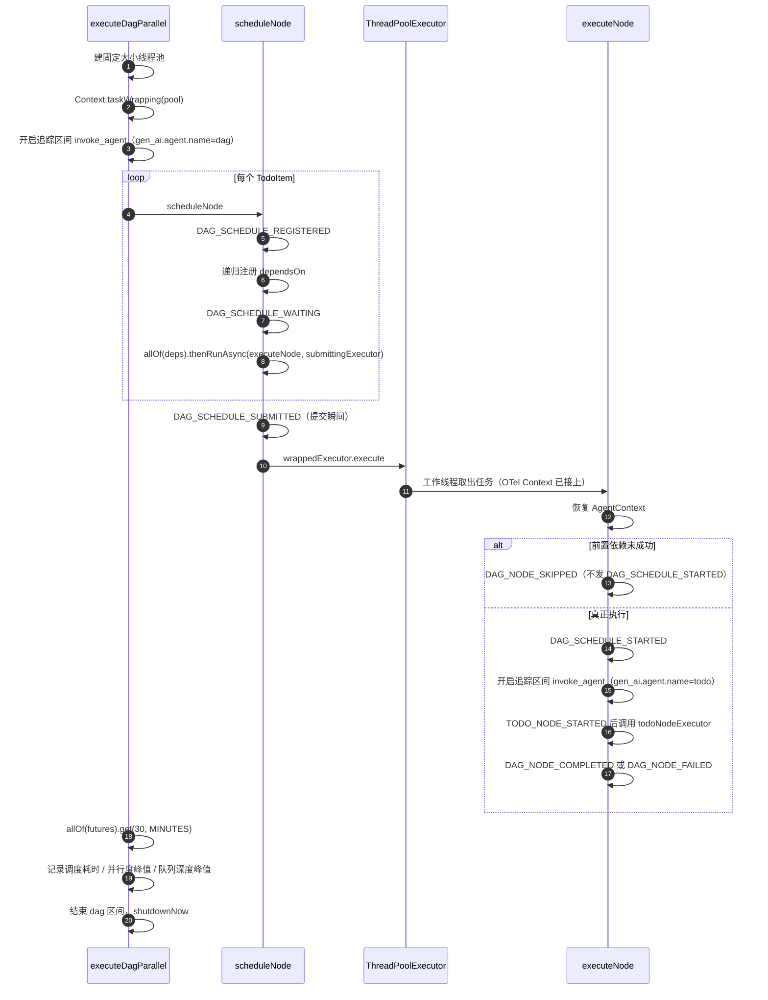

# DAG 调度观测

本文对照 `LangchainDagWorkflowExecutor` 的实际调度顺序，说明新增的结构化事件、指标和追踪区间。既有 `DAG_NODE_COMPLETED` / `DAG_NODE_FAILED` / `DAG_NODE_SKIPPED` 名字不变；整图等待仍是 30 分钟；对外执行结果不变。

## 调度时序

调度线程先建图、做环检测，再进入 `executeDagParallel`。每个节点只通过 `computeIfAbsent` 注册一次；依赖用 `CompletableFuture.allOf` 等待；依赖齐了之后 `thenRunAsync` 把节点交给固定大小线程池。工作线程先恢复 `AgentContext` 快照，再决定跳过或真正执行。

对照代码里的五个插入点：

| 序号 | 位置 | 事件 |
|---|---|---|
| 1 | `scheduleNode` 的 `computeIfAbsent` 入口 | `DAG_SCHEDULE_REGISTERED` |
| 2 | 依赖 Future 已收集、`allOf` 之前 | `DAG_SCHEDULE_WAITING` |
| 3 | `submittingExecutor` 调用 `execute` 之前 | `DAG_SCHEDULE_SUBMITTED` |
| 4 | `executeNode` 跳过检查通过之后、真正执行之前 | `DAG_SCHEDULE_STARTED` |
| 5 | `executeNode` 终态（原逻辑） | `DAG_NODE_COMPLETED` / `DAG_NODE_FAILED` / `DAG_NODE_SKIPPED` |

无依赖的节点也会发 `DAG_SCHEDULE_WAITING`：`allOf` 空数组会立刻完成，随后马上提交。跳过发生在工作线程里、真正执行之前，所以跳过节点有 SUBMITTED，没有 STARTED。

线程池每次调度临时创建，不是 Spring bean。`Context.taskWrapping` 只叠加在原有 `AgentContext.capture/restore` 之上，用来把调度线程上的 OTel Context 带到工作线程；没有接入 SDK 时 `GlobalOpenTelemetry` 是空操作。

## 词汇映射

### 事件

| 事件名 | 何时发出 | payload |
|---|---|---|
| `DAG_SCHEDULE_REGISTERED` | 节点首次进入 `computeIfAbsent` | `todo_id` |
| `DAG_SCHEDULE_WAITING` | 开始等依赖 Future | `todo_id` |
| `DAG_SCHEDULE_SUBMITTED` | 任务交给线程池 | `todo_id` |
| `DAG_SCHEDULE_STARTED` | 跳过检查通过后开始执行 | `todo_id` |
| `DAG_NODE_COMPLETED` | 节点成功（既有，未改名） | `todo_id`, `tool_calls_used` |
| `DAG_NODE_FAILED` | 节点失败（既有，未改名） | `todo_id`, `summary` |
| `DAG_NODE_SKIPPED` | 因依赖失败而跳过（既有，未改名） | `todo_id`, `failed_dependency` |

另有既有的 `TODO_NODE_*` / `DAG_EXECUTION_STARTED`，这次没有改这些名字。

### 指标

前缀 `alphafrog.dag`。不把 `runId` / `todoId` 打成标签。

| 指标名 | 类型 | 口径 |
|---|---|---|
| `alphafrog.dag.node.count` | DistributionSummary | 本次调度的 DAG 节点数 |
| `alphafrog.dag.dependency.depth.max` | DistributionSummary | 依赖链最大深度：沿 `dependsOn` 走到源头，最长那条链上的节点数；单节点为 1 |
| `alphafrog.dag.schedule.duration` | Timer | `executeDagParallel` 墙钟时间，含排队与执行等待 |
| `alphafrog.dag.parallelism` | Gauge | 当前进程里已经进入真正执行（`todoNodeExecutor.execute` 之前）且尚未离开的节点数；跳过不计 |
| `alphafrog.dag.parallelism.max` | DistributionSummary | 上述并行度在本次调度中的峰值 |
| `alphafrog.dag.queue.depth` | Gauge | 线程池队列当前长度 |
| `alphafrog.dag.queue.depth.max` | DistributionSummary | 每次提交后读到的队列长度在本次调度中的峰值 |

五项观测对应：节点数、依赖链最大深度、调度耗时、实际并行度、队列深度。并行度与队列深度各保留瞬时 gauge 和一次调度结束时的峰值 summary，方便事后对照。

### 追踪

操作名复用 OTel GenAI 语义约定的 `invoke_agent`（`gen_ai.operation.name`）。区间名也用这个标准操作名；用 `gen_ai.agent.name` 区分整图和节点。

| 区间 | span name | 属性 |
|---|---|---|
| 整图调度 | `invoke_agent` | `gen_ai.operation.name=invoke_agent`，`gen_ai.agent.name=dag` |
| 节点执行 | `invoke_agent` | `gen_ai.operation.name=invoke_agent`，`gen_ai.agent.name=todo`，`gen_ai.agent.id={todoId}` |

节点区间在 `DAG_SCHEDULE_STARTED` 之后开启，跳过节点不开节点区间。工作线程通过 `Context.taskWrapping` 接到整图区间，因此节点区间是整图区间的子区间。
