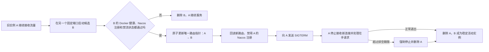

# 0-3 Beta 部署单与流量状态合同

本文固定 Beta 部署控制器使用的两类运行时文件。`manifest.json` 记录一个隔离流量范围希望运行哪些服务，`controller-state.json` 记录每个服务当前由哪个实例接收新流量，以及是否有候选实例正在启动、旧实例正在排空。

配套的可执行结构是：

- `deploy/beta/manifest.schema.json`
- `deploy/beta/controller-state.schema.json`
- `deploy/beta/verify-contract.mjs`

这套合同适用于 AlphaFrog 的所有服务。部署控制器不会因为某个服务处理 Agent Run、普通 HTTP 请求或行情查询而采用不同流程。

## 1. 要解决的问题

更新服务时，新旧实例需要短暂共存：



候选实例健康以前，旧实例继续承接流量，所以更新不会主动制造维护窗口。流量切换以后，部署控制器不重试旧实例里的请求，也不判断这些请求最终成功还是失败。

部署控制器只管理五类事实：

1. 当前默认流量指向哪个实例。
2. 是否有候选实例正在启动或等待健康检查。
3. 是否有旧实例正在排空。
4. 容器、端口和 Nacos 注册分别对应哪个实例。
5. 最近一次部署操作失败在哪里。

Agent Run、数据库事务、业务重试和业务恢复不属于本合同。部署控制器不查询 Run 表，不统计活动 Run，也不根据业务结果回滚流量。

首版最多管理 8 台机器，由一个控制器进程串行执行变更。同一时刻全局最多有一个服务的 `operation` 不为空。本合同不设计控制器集群选主、资源额度、跨机器租约或并行发布调度。

## 2. 流量范围和两个端口槽

`trafficScopeId` 表示一组彼此隔离的流量和实例。主 Beta 固定使用 `main-beta`，泳道使用 0-2 分配的其他标识。同一个服务可以同时出现在主 Beta 和多条泳道里，但 `trafficScopeId + serviceName` 不同，就必须使用彼此独立的实例集合和默认路由。

一个部署单描述一个完整流量范围。同一时刻只能有一个活动部署占用某个 `trafficScopeId`，不能用两个部署共同维护同一范围。

每个服务固定配置两个不同的宿主端口，称为端口槽 `A` 和 `B`。容器内端口保持不变：

- 稳定状态下，活动实例占用一个槽，另一个槽空闲。
- 更新时，候选实例占用另一个槽，所以新旧实例可以同时运行。
- 切换完成并删除旧实例后，两个槽的角色互换；下一次更新再使用空闲槽。

端口由部署单的 `runtime.hostPorts` 固定，控制器不能临时另选端口。`machineId` 指向 2-4 控制器配置中的静态机器表；机器地址和访问凭据不写进部署单。机器无法访问时，控制器不能把“没有查到容器”解释成“容器不存在”。

## 3. Nacos 注册和默认路由

当前环境固定使用 Nacos 2.5.0，注册、查询和更新实例以 [Nacos 2.x 命名 OpenAPI](https://nacos.io/en/docs/v2/guide/user/open-api/) 或同版 Java SDK 为准，不使用 3.x 管理接口推测 2.5.0 行为。`AF_CONFIG_NACOS_NAMESPACE` 为空时，2-4 必须在发起请求前规范为 `public`；部署单、全局状态和查询参数中都只保存 `public`，不保存空串。

新旧实例在切换窗口中都按实例注册到 Nacos。每条实际注册记录保存完整服务名、分组、命名空间、集群、IP、端口、Nacos 实例标识，以及会影响选择结果的 `enabled`、`healthy`、`weight`、`ephemeral`。注册元数据的键名固定为：

- `alphafrog.traffic-scope-id`：实例属于哪个主 Beta 或泳道范围。
- `alphafrog.release-id`：实例属于哪个服务版本。
- `alphafrog.instance-id`：该次部署生成的实例标识。

因此正常更新时查询到两个实例不是错误。控制器必须逐字比较完整注册键、三个固定元数据键和四个可选择事实，不能以“查询结果恰好一条”代替身份核对。

默认路由由 `trafficScopeId + serviceName` 唯一定位。首版的实际执行方法是：2-4 提供路由快照接口，2-5 入口和 2-3 服务调用路由器必须根据这份快照选择精确的 `instanceId + endpoint`。Beta 流量禁止直接从未过滤的 Nacos 实例列表随机选择。路由快照包含：

- `route.defaultInstanceId`：默认实例。
- `route.defaultReleaseId`：新请求和后续服务调用使用的默认版本标签。
- `route.routeVersion`：每次创建、切换或移除默认路由时递增。
- `route.updatedAt`：该路由事实的原子切换时间。

首版不缓存可变的默认路由指针。每个新入口请求或新服务调用开始时，2-5 或 2-3 都从同一个原子路由执行点读取一次当前指针，并把该请求绑定到返回的精确实例。路由读取是新请求的线性化时刻：原子替换以前已经读到 A 的请求继续由 A 完成；替换以后才开始读取的请求只能得到 B。路由执行点无法读取时停止转发 Beta 新请求，不能继续使用上一份指针，也不能回退到未过滤的 Nacos 列表。

控制器通过一次 `controller-state.json` 原子替换同时更新默认指针和实例角色。路由接口回读相同 `routeVersion` 后，控制器把旧 Nacos 实例改为 `enabled=false, weight=0` 并回读确认，然后发送 SIGTERM。

候选注册时先固定为 `enabled=false, weight=0, ephemeral=true`，因此切换前它不具备默认流量资格。候选就绪后，控制器先把它改为 `enabled=true, weight=1`并回读，再发布指向它的路由快照。这个短窗口里路由仍精确指向旧实例，所以新实例仍不会获得默认流量。

`controller-state.json` 是路由指针的持久化依据，2-4 路由接口只能返回已成功原子替换的完整指针。控制器重启后必须通过一次独立接口请求回读路由，不能仅凭写文件的函数返回成功就宣称切流已生效。

Nacos 负责保存并发现按版本区分的实例，路由事实负责决定无显式版本的新流量使用哪个版本。Nacos 中同时存在新旧实例不等于新旧实例同时接收默认流量。

## 4. 运行时文件和写入规则

运行时路径固定为：

```text
/var/lib/alphafrog-beta/
├── controller-state.json
└── deployments/
    └── <deployment-id>/
        └── manifest.json
```

全局状态文件是 `/var/lib/alphafrog-beta/controller-state.json`。单个部署的部署单是 `/var/lib/alphafrog-beta/deployments/<deployment-id>/manifest.json`。2-4 控制器和测试必须直接引用这两个文件名。

两个文件都使用 UTF-8 JSON，禁止重复键。每次更新先在目标目录写临时文件，对文件执行 `fsync`，再使用原子重命名替换正式文件，最后对父目录执行 `fsync`。`controller-state.json` 每次成功替换时把 `stateVersion` 加 1。

部署控制器是 `manifest.json` 的唯一写入者。它先校验请求、生成完整部署单、重新计算摘要，再原子写入文件。调用方不能直接改运行时文件。同一个部署存在任何未完成 `operation`，或者整个部署处于 `DELETING` 时，控制器拒绝接受新部署单，防止新版本覆盖正在执行的目标。

两个文件不能一起原子替换，所以只允许一个短暂领先窗口：新 `manifest.json` 已经落盘，而 `controller-state.json` 仍保存旧 `acceptedManifestVersion`，并且没有未完成操作。重启后控制器重新校验新部署单，再把新版本接受进全局状态。全局状态不能领先部署单，也不能在操作执行中被另一版部署单覆盖。

## 5. 部署单 `manifest.json`

部署单保存期望配置，不保存容器标识、健康结果、当前路由或排空进度。

### 5.1 顶层字段

| 字段 | 含义 |
| --- | --- |
| `schemaVersion` | 首版固定为 `1` |
| `deploymentId` | Beta 部署标识；保留值 `stable` 禁止使用 |
| `trafficScopeId` | 主 Beta 或某条泳道的隔离流量范围 |
| `manifestVersion` | 同一部署从 1 开始严格递增的部署单版本 |
| `gitCommit` | 这次部署对应的 40 位 Git 提交标识 |
| `owner` | 至少包含 `ownerId`，用于找到部署负责人 |
| `createdAt`、`expiresAt` | UTC 时间；到期触发删除操作，不触发业务恢复 |
| `services` | 该流量范围的完整服务集合，`serviceName` 必须唯一；首版普通更新只能保持或增加服务，不能移除已有服务 |

### 5.2 服务字段

每个服务包含：

- `serviceName`：服务名。
- `releaseId`：该服务这次发布的可追踪版本标识。不同服务可以使用不同版本，因此它属于服务而不是部署单顶层。
- `serviceSpecSha256`：本服务完整配置的规范 JSON 摘要。
- `machineId`：服务运行在哪台静态 Beta 机器。
- `image.repositoryDigest`：不可变仓库镜像引用。
- `image.localImageId`：目标机器已经安装的本地镜像标识。
- `runtime.containerPort`：容器内端口。
- `runtime.hostPorts`：两个不同的固定宿主端口，数组第一个对应槽 A，第二个对应槽 B。
- `runtime.healthCheckProfile`：2-4 为专用 Compose 注入的固定健康检查方案，首版只接受 `CONTROLLER_TCP_V1`。
- `runtime.readinessTimeoutSeconds`：候选容器从启动到必须就绪的最长时间。
- `runtime.shutdownProfile`：服务在 SIGTERM 后怎样停止接收新请求并等待在手请求。
- `runtime.applicationDrainSeconds`：应用内部允许排空的最长时间。
- `runtime.drainGraceSeconds`：Docker 在 SIGTERM 后等待的总时间；它至少比应用排空上限多 5 秒，留给进程退出和容器清理。
- `registration`：Nacos 服务名、分组、命名空间和集群模板。
- `runtimeConfigSha256`：可选运行配置摘要；秘密值本身不得写入部署单。

当前业务服务的 Dockerfile 和常规 Compose 没有普遍提供 `HEALTHCHECK`，所以 2-4 必须在 Beta 专用 Compose 中提供它。2-4 向容器只读挂载一份由控制器发布的固定 TCP 探针，并注入执行 `/opt/alphafrog-beta/bin/tcp-healthcheck 127.0.0.1 <containerPort>` 的 Compose `healthcheck`。部署单不接受任意命令、脚本路径或网络 URL。探针、挂载或 Docker 健康状态缺失时，候选发布失败。

`READY` 不等于“容器进程存活”。它必须同时满足：Docker 返回 `State.Health.Status=healthy`；Nacos 查到唯一份完整身份匹配的注册且 `healthy=true`；注册仍为 `enabled=false, weight=0`；路由接口仍精确指向旧实例（首次创建时为空）。这一条件让 RPC 注册比 TCP 端口晚几秒时不会提前切流。

排空统一执行 `docker stop --signal SIGTERM --timeout <drainGraceSeconds>`，明确覆盖镜像可能配置的其他 `STOPSIGNAL`。[Docker stop 命令文档](https://docs.docker.com/reference/cli/docker/container/stop/)说明了显式信号、超时和强制停止行为。只发 SIGTERM 不足以证明已排空，因此 2-4 还必须按 `shutdownProfile` 注入并预检以下固定配置：

- `SPRING_BOOT_HTTP_V1`：`server.shutdown=graceful` 和 `spring.lifecycle.timeout-per-shutdown-phase=<applicationDrainSeconds>s`。
- `SPRING_BOOT_DUBBO_V1`：上述 Spring 生命周期上限，以及 `dubbo.service.shutdown.wait=<applicationDrainSeconds * 1000>` 毫秒。
- `SPRING_BOOT_HTTP_DUBBO_V1`：同时执行 HTTP 和 Dubbo 的两类约束，整个进程必须在同一 `applicationDrainSeconds` 上限内退出。

[Spring Boot 3.2.3 优雅停机文档](https://docs.spring.io/spring-boot/docs/3.2.3/reference/html/web.html#web.graceful-shutdown)说明了 `server.shutdown=graceful` 和生命周期超时的作用；[Dubbo 优雅停机文档](https://dubbo.apache.org/en/overview/mannual/java-sdk/tasks/shutdown/) 说明了服务端等待请求完成的配置。2-4 必须在专用 Compose 生成后检查有效配置；不识别的服务协议或未实现的停机方案直接拒绝发布。这是 2-4 与 4-4 必须实现和验证的前置，不是当前服务已经具备的事实。

`serviceSpecSha256` 使用 RFC 8785 JSON Canonicalization Scheme（JCS，规范 JSON 序列化）计算。输入是当前服务对象删除 `serviceSpecSha256` 后的结果。2-4 每次读取部署单时重新计算，摘要不一致就拒绝应用。

`manifestSha256` 使用同一套 JCS 规则计算，输入是已经填好每个 `serviceSpecSha256` 的完整部署单对象。部署单本身不含 `manifestSha256`，所以不删除任何顶层字段。摘要输入是 JCS 产生的 UTF-8 字节，不是原始文件的空格、换行或键顺序。配套脚本中完整有效样例的固定预期值是 `33374acd2c19107cca9c23cf9dda3ccc1590678f2aa3e2a2fc7c62cf0d62c40b`；同一对象的紧凑排版和缩进排版都必须得到该值。

## 6. 全局状态 `controller-state.json`

全局状态保存控制器已经接受的部署单身份，以及 Docker、Nacos 和路由层观察到的事实。它不保存业务请求、Run 标识、事务结果、资源预算或历史幂等回执。

### 6.1 部署状态

部署记录包含 `deploymentId`、`trafficScopeId`、`acceptedManifestVersion`、`manifestSha256`、`gitCommit`、`owner`、`expiresAt` 和服务列表。`phase` 只有：

- `ACTIVE`：部署单存在，至少还有一个服务状态。首次创建多个服务时，未轮到的服务也保存在列表中。
- `DELETING`：整个部署正在删除；未轮到的服务保持 `STABLE`，当前最多一个服务执行 `DELETE`，清理完成的服务逐个从列表移除。任一服务进入 `FAILED` 后停止选择下一个服务。

这些重复字段必须与当前部署单逐项相等。只有删除部署的最后一个固定窗口允许 `phase=DELETING`、`services=[]` 且 `manifest.json` 已不存在；控制器随后只需移除部署记录。

### 6.2 服务状态

一个服务槽位最多保存三个实例位置：

| 字段 | 含义 |
| --- | --- |
| `activeInstance` | 当前默认流量应进入的活动实例 |
| `candidateInstance` | 正在启动或等待就绪的候选实例 |
| `drainingInstance` | 已经退出默认路由、正在排空的旧实例 |

首版全局串行操作，所以同一个服务最多有一个旧实例排空，不使用数组累积多代实例。如果旧实例到排空期限仍未退出，控制器强制停止并删除它，然后释放端口槽。

`targetManifestVersion` 和 `targetServiceSpecSha256` 必须等于当前已接受部署单中该服务的 `manifestVersion` 和 `serviceSpecSha256`。它们表示本次部署目标，不等于活动实例当前运行的版本。更新在切流前失败时，这两个目标字段不回退；旧活动实例仍保留自身的 `manifestVersion` 和 `serviceSpecSha256`，`failedManifestVersion` 记录失败目标。这样状态接口可以同时说明“当前仍运行旧版本”和“哪一版更新失败”。

一个多服务部署单被接受后，全局串行规则只允许其中一个服务开始操作。尚无活动实例的新服务保存为 `CREATING + operation=null + candidateInstance=null`；已有活动实例的服务保持 `STABLE + operation=null`。轮到新服务时，控制器才原子写入 `CREATE` 操作；轮到已有服务时才进入 `UPDATING`。排队的 `STABLE` 服务活动实例可以仍是上一代，目标字段已经指向新部署单。因此 `STABLE` 有三种正常判断：活动版本等于目标表示已经达到目标；活动版本落后且 `failedManifestVersion != targetManifestVersion` 表示等待普通调度；活动版本落后且两者相等表示失败暂停，普通扫描不得重试。

服务 `phase` 有五种：

- `CREATING`：没有活动实例，正在排队或创建第一个候选。排队时 `operation` 和 `candidateInstance` 都是 `null`。
- `STABLE`：一个活动实例接收默认流量，没有候选、排空实例或当前操作。
- `UPDATING`：旧活动实例继续服务，或者新活动实例已经切流而旧实例正在排空。
- `DELETING`：默认路由正在移除，或者原活动实例正在排空。
- `FAILED`：控制器无法唯一确认安全下一步，当前操作已经停止，保留实例和错误事实供人处理。

`failedManifestVersion` 和 `lastError` 记录最近一次失败目标。两者必须同时为空或同时非空，不能只有失败版本而没有错误类别。`lastError.failedOperationType` 说明失败发生在创建、更新还是删除；`lastError.recoveryClass` 只允许三类：

- `CLEAN_RETRYABLE`：候选容器和注册已确认清理，当前路由事实唯一，可以由显式重试重新开始当前服务。
- `FACTS_UNCERTAIN`：容器、Nacos 或路由的实际事实不唯一。人工消除冲突并由控制器重新核对前，提高部署单版本也不能解除暂停。
- `DELETE_RETRYABLE`：当前删除服务的身份仍唯一，可以显式重试这一个服务；后续服务仍不能越过它。

候选在切流前明确失败且可以安全删除时，旧活动实例和旧路由不变，更新服务回到 `STABLE`，同时保留本次失败版本和 `CLEAN_RETRYABLE` 错误。首次创建没有活动实例，清理成功后保存为 `FAILED + CLEAN_RETRYABLE`。活动实例意外消失、机器查询不确定、对象身份冲突或路由事实与实例角色不一致等情况保存为 `FAILED + FACTS_UNCERTAIN`。

### 6.3 实例状态

三类实例都保存实例标识、机器、服务版本、部署单版本、服务摘要、容器名称与标识、端口槽、宿主端口、可路由地址和完整 Nacos 注册事实。

候选实例另外保存 `readiness`、`readinessObservedAt` 和 `readinessDeadline`。控制器用候选启动时间加 `readinessTimeoutSeconds` 得到截止时间，并在等待健康以前落盘。Docker 状态映射固定为：`starting` 写 `STARTING`，`healthy` 写 `READY`，`unhealthy` 或缺少 HEALTHCHECK 写 `FAILED`；目标机器无法访问写 `UNKNOWN`，不能把候选当作已经不存在。到达截止时间仍未 `READY` 也按候选失败处理。

排空实例另外保存 `drainStartedAt` 和 `drainDeadline`。`drainStartedAt` 是原子路由指针已移开该实例的时间；从这一时刻开始，新请求不再绑定该实例。这两个时间已经在同一次路由切换中持久化，因此控制器在发送 SIGTERM 前一定能读到截止时间。实例正常退出或到期强制停止后，先注销该实例的 Nacos 注册并删除容器，再清空 `drainingInstance`。

### 6.4 当前操作

当前操作类型只有 `CREATE`、`UPDATE` 和 `DELETE`，阶段只有六个：

| 阶段 | 含义 |
| --- | --- |
| `STARTING_CANDIDATE` | 已分配候选实例标识，正在创建容器 |
| `WAITING_CANDIDATE_READINESS` | 候选容器存在，等待 Docker 健康检查 |
| `SWITCHING_TRAFFIC` | 候选就绪，准备原子替换默认路由和实例角色 |
| `DRAINING_PREVIOUS` | 新实例已接收默认流量，旧实例正在排空 |
| `REMOVING_TRAFFIC` | 删除服务时正在移除默认路由 |
| `DRAINING_ACTIVE` | 删除服务时原活动实例正在排空 |

`CREATE` 只使用前三个阶段；`UPDATE` 额外使用 `DRAINING_PREVIOUS`；`DELETE` 只使用 `REMOVING_TRAFFIC` 和 `DRAINING_ACTIVE`。创建容器以前，控制器先生成 `candidateInstanceId` 并写入 `STARTING_CANDIDATE`，此时完整 `candidateInstance` 可以仍为 `null`。确定容器事实以后才填写候选记录。

## 7. 创建、更新和删除

### 7.1 创建

部署第一次包含多个服务，或者后续部署单一次增加多个服务时，控制器先把所有新增服务写成 `CREATING + operation=null + candidateInstance=null`。如果全局没有当前操作，也没有任何服务停在 `FAILED`，控制器按 `trafficScopeId`、`serviceName` 的字典序选择一个排队服务，并在一次全局状态替换中为它建立 `CREATE` 操作。其余新增服务继续排队，不会同时创建第二个候选。当前服务成为 `STABLE` 后才选择下一个；当前服务进入 `FAILED` 时停止这个部署的自动创建，等待人显式重试或提交可接受的新部署单。

```text
CREATING / STARTING_CANDIDATE
  → 在槽 A 或 B 创建候选，以 enabled=false / weight=0 注册 Nacos
  → WAITING_CANDIDATE_READINESS
  → Docker 健康、Nacos healthy 且仍无默认流量
  → SWITCHING_TRAFFIC
  → 启用 Nacos 实例并回读，再发布和回读默认路由
  → 候选成为 activeInstance
  → STABLE，清空 operation
```

候选缺少 HEALTHCHECK、明确 `unhealthy` 或到截止时间仍未就绪时，控制器删除候选容器和注册，写入 `FAILED + CLEAN_RETRYABLE`，不生成或重试业务请求。显式 `RETRY_CREATE` 必须在同一次全局状态替换中重新核对空路由和无实例事实，再把该服务从 `FAILED` 改为 `CREATING / STARTING_CANDIDATE`并建立新 `operationId`。后续新服务仍保持空操作的 `CREATING`，不能被越过。

### 7.2 更新

更新开始时，旧 `activeInstance` 和旧路由保持不动。候选必须使用另一个端口槽，并在注册元数据中使用新 `releaseId`。服务存在期间，`machineId` 和两个 `hostPorts` 不可变；需要移动机器或更换端口时，调用方必须先完成删除，再按新部署创建，不能把这类迁移伪装成普通更新。

候选缺少 HEALTHCHECK、明确 `unhealthy` 或到截止时间仍未就绪时，只删除候选的容器和 Nacos 注册，旧实例继续服务并回到 `STABLE + CLEAN_RETRYABLE`。如果机器无法访问，控制器不能确认候选是否已删除，服务进入 `FAILED + FACTS_UNCERTAIN` 并保留候选事实。普通扫描不自动重试失败目标。更高部署单或显式 `RETRY_UPDATE` 只能在活动实例、旧路由和候选已清理事实都唯一时，于同一次状态替换中清除失败暂停，将 `STABLE` 改为 `UPDATING / STARTING_CANDIDATE` 并建立新 `operationId`。`FACTS_UNCERTAIN` 必须先由人消除冲突，提高版本不能直接清除。

候选就绪后，控制器先写入 `SWITCHING_TRAFFIC` 检查点，启用候选注册并回读。下一次全局状态原子替换同时发布指向候选的新路由、把候选变成 `activeInstance`、把旧活动实例变成 `drainingInstance`、写入 `drainStartedAt/drainDeadline`，并进入 `DRAINING_PREVIOUS`。这次替换是唯一切流时刻：替换前已经读到旧指针的请求继续由旧实例完成，替换后开始的新入口请求和新服务调用只能读到候选实例。

替换成功后，控制器必须通过一次独立路由接口请求回读同一 `routeVersion` 和候选精确端点。回读失败或结果不一致时，控制器保留当前状态并报告错误，不禁用旧注册，也不发送 SIGTERM。回读成功后，控制器将旧 Nacos 实例改为 `enabled=false, weight=0`并再次回读；确认旧实例不再可选择后，才对旧容器执行带超时的停止。旧请求的成功、失败或业务重试不改变部署状态。旧实例退出或被强制停止、注册和容器都清理后，服务进入 `STABLE`。

### 7.3 删除整个部署

首版普通新部署单禁止从 `services` 中移除已有服务。需要减少服务集合时，调用方先删除整个部署，等实例和端口全部清理，再用新的完整服务集合创建部署。这样删除期间原部署单一直保留每个服务的目标、机器和两个端口，不需要增加单服务删除墓碑。

删除整个部署时，每个服务先进入 `REMOVING_TRAFFIC`。下一次全局状态原子替换同时发布空路由、把活动实例移入 `drainingInstance`、写入 `drainStartedAt/drainDeadline`，并进入 `DRAINING_ACTIVE`。这次替换以后开始的新入口请求和新服务调用读到空路由并立即拒绝，不能继续使用删除前的指针。控制器必须通过一次独立路由接口请求回读空路由和新 `routeVersion`；回读失败或结果不一致时，不禁用旧注册，也不发送 SIGTERM。回读成功后，控制器把旧 Nacos 实例改为 `enabled=false, weight=0`并回读，再发送 SIGTERM。实例退出或到期强制停止后，控制器注销注册、删除容器并移除服务状态。

删除整个部署时，控制器先确认没有其他当前操作，再把部署 `phase` 写成 `DELETING`。尚未轮到的服务保持 `STABLE + operation=null`；控制器按 `serviceName` 字典序选择一个服务，原子写入它的 `DELETING + DELETE operation`，完成后移除该服务，再选择下一个。查询机器、容器或 Nacos 时若无法唯一确认结果，当前服务进入 `FAILED + operation=null`，剩余服务继续保持 `STABLE`，整个部署停止自动删除。显式 `RETRY_DELETE` 只能重建这一服务的 `DELETE` 操作，并从实际路由、Nacos 和容器事实唯一确定的阶段继续。后续服务不能被越过；不确定事实未消除时不能重建操作。

服务列表为空后，控制器删除固定路径下的 `manifest.json`，同步父目录，再移除全局部署记录。控制器只删除这一个已知文件并尝试删除空目录，不递归删除部署目录。

## 8. 控制器重启后的最小核对

首版不保证在每个外部调用中断点自动恢复。控制器重启时只做一次有限核对：

1. 读取并校验两类文件；失败就停止写操作并报告错误。
2. 按 `machineId` 查询记录中的容器，按完整注册键查询 Nacos 2.5.0，并从 2-4 路由接口回读当前 `routeVersion` 和精确端点。`controller-state.json` 是持久化依据，不是已生效路由的唯一证据。
3. 容器名称和标签必须同时匹配 `deploymentId`、`trafficScopeId`、`serviceName`、`instanceId` 和 `releaseId`。仅找到一个完全匹配对象时可以补齐状态；找到多个对象或身份冲突时写 `FAILED`。
4. 路由接口仍指向旧实例时，旧实例继续服务；接口已经指向候选时，实例角色必须是“候选已成为活动实例、旧实例正在排空”；接口已经返回空路由时，活动实例必须已经移入排空角色。接口、持久化指针和实例角色不一致时写 `FAILED + FACTS_UNCERTAIN`，不猜测哪一方正确。
5. 候选仍在等待时，控制器同时检查 Docker 健康、Nacos 身份与可选择事实、路由仍未指向候选，再按 `readinessDeadline` 继续或失败。
6. 处于 `DRAINING_PREVIOUS` 或 `DRAINING_ACTIVE` 时，控制器先核对路由接口已经返回持久化的当前指针，再核对旧注册。旧注册仍可选择时先把它改为 `enabled=false, weight=0`并回读；确认禁用后才按剩余 `drainDeadline` 幂等发送停止命令。容器已退出时继续注销 Nacos、删除容器并清空排空记录。
7. 机器、Nacos 或路由接口查询失败时保留最后事实并写错误，不把“无法观察”当作“对象不存在”。

如果这些事实不能唯一决定下一步，控制器停在 `FAILED`，由人重新操作。它不建设多阶段自动回滚、通用人工修复工作流或业务请求恢复。

## 9. Schema 之外的一致性检查

JSON Schema 负责字段、类型、枚举和基本组合。2-4 选用的 Draft 2020-12 校验器必须开启 `date-time`、`ipv4` 和 `ipv6` 的 `format` 断言，不能把 `format` 当作注释。启动自检必须证明合法 IPv4、合法 IPv6 通过，普通文本 IP 和伪 UTC 时间被拒绝；自检失败时控制器拒绝启动。2-4 还必须执行以下跨记录检查：

1. `deploymentId` 唯一；一个 `trafficScopeId` 最多对应一个活动部署；部署内 `serviceName` 唯一。
2. 所有实例标识、容器标识和完整 Nacos 注册身份全局唯一。同一服务的活动、候选和排空实例不能使用相同 `instanceId` 或端口槽。所有活动部署单中的两个预留槽都参与检查，`machineId + hostPort` 全局唯一；主 Beta、不同泳道和不同服务也不能重叠。服务仍存在时，新部署单的 `machineId + hostPorts` 必须与旧状态一致，因此未退出的上一代实例不会因为部署单改址而提前释放端口。
3. 候选实例和切流后的新活动实例必须匹配当前目标的 `manifestVersion`、`serviceSpecSha256` 和 `releaseId`。切流前的旧活动实例、切流后的排空实例保留自身上一代事实。`STABLE` 的活动实例可以等于目标，也可以在正常排队或失败暂停时仍是上一代。所有实例的注册端口等于宿主端口；三个固定 metadata 值等于实例的流量范围、版本和实例标识；`ephemeral=true`。候选在切换前必须 `enabled=false, weight=0`。路由刚切换或移除时，排空实例的已观察注册可以暂时仍是 `enabled=true, weight=1`；发送 SIGTERM 前必须已经改成 `enabled=false, weight=0`并回读确认。其他 `enabled/weight` 组合非法。
4. `STABLE` 必须只有一个活动实例，且默认实例和默认版本等于活动实例；不能有候选、排空实例或当前操作。`CREATING` 的默认实例和默认版本必须为空。
5. `UPDATING` 切流前必须保存“旧活动实例 + 新候选实例”，路由仍指向旧活动实例；同一次原子替换发布新路由后必须保存“新活动实例 + 旧排空实例”，路由逐字指向新活动实例，并进入 `DRAINING_PREVIOUS`。删除在 `REMOVING_TRAFFIC` 时路由仍等于活动实例；同一次原子替换发布空路由后把活动实例移入排空角色，并进入 `DRAINING_ACTIVE`。两种替换都要同时写入排空起止时间。
6. 全部部署合计最多一个非空 `operation`。没有当前操作时，只要某个部署内存在 `FAILED` 服务，控制器就停止该部署的自动调度。普通调度只能选择没有失败暂停的排队服务；失败创建、更新和删除必须分别走第 7 节的显式原子转换。`FACTS_UNCERTAIN` 不能被更高部署单版本直接清除；删除失败时只能恢复当前服务的 `DELETE`，不能选择后续服务。
7. `CREATE/UPDATE` 操作先保存非空 `candidateInstanceId`。`STARTING_CANDIDATE` 允许完整候选记录暂时为 `null`；候选记录出现后，它的 `instanceId` 必须逐字等于预分配的 `operation.candidateInstanceId`。`DELETE` 和 `DRAINING_PREVIOUS` 的 `candidateInstanceId` 必须为 `null`。排空期限必须等于或晚于排空开始时间，部署到期时间必须晚于创建时间。
8. 部署记录的 `acceptedManifestVersion`、按第 5.2 节 JCS 算法计算的 `manifestSha256`、Git 提交、负责人、到期时间和服务目标必须与部署单一致；只允许第 4 节定义的新部署单领先窗口和删除窗口。

任一检查失败时，控制器停止新的外部写操作并记录部署错误。它不会根据业务 Run 或请求结果修复状态。

## 10. 状态接口和验收

状态接口按流量范围和服务至少返回：

- `trafficScopeId`、`serviceName` 和服务 `phase`。
- 活动、候选和排空实例标识。
- 默认实例、默认版本、路由版本和切换时间。
- 每个实例的 Nacos `enabled`、`healthy`、`weight`、`ephemeral` 与候选就绪状态。
- 当前操作类型和阶段。
- 最近一次部署错误和失败的部署单版本。

0-3 的可重放验证入口是 `node deploy/beta/verify-contract.mjs`。脚本会用固定版本的 AJV CLI 与 `ajv-formats` 严格编译两份 Schema，生成临时正反例并运行跨字段检查。运行环境需要 Node.js 和可使用的 npm 包源；实现仓库后应把固定依赖收入正常测试任务，不在运行时下载。

静态验收至少覆盖：

- 两份 Schema 通过 Draft 2020-12 元 Schema校验；开启格式断言后 IPv4/IPv6 正例通过，普通文本 IP 和伪 UTC 时间反例失败。
- 合法部署单通过；重复服务、相同的两个宿主端口、可变镜像标签、错误摘要和保留标识 `stable` 被拒绝。
- 普通部署单移除已有服务被拒绝；删除整个部署时，原部署单保留到全部服务完成排空和清理。
- 自定义检查拒绝两个部署在同一机器预留重叠宿主端口，并同时覆盖跨服务和跨流量范围冲突。
- 自定义检查拒绝普通更新改变 `machineId` 或两个固定宿主端口，并覆盖上一代容器尚未退出时不能释放旧端口。
- 创建起点、候选就绪、切流后排空、稳定状态和删除排空样例通过。
- `CREATE/UPDATE/DELETE` 与阶段的非法组合被拒绝。
- 自定义检查拒绝同一范围的两个部署、全局两个并行操作、活动与候选共用端口槽、Nacos 身份重复、`STABLE` 路由不指向活动实例。
- 候选验收覆盖 Docker 健康、Nacos `healthy=true`、候选仍禁用和路由未指向候选的四项联合条件。路由验收覆盖单一原子切换时刻：切换前已经绑定旧实例的请求保持完成，切换后的每个新入口请求和新服务调用都重新读取指针并只得到新实例；删除指针后新请求立即拒绝；指针不可读时失败关闭。验收还要覆盖路由回读、旧 Nacos 实例禁用并回读后才 SIGTERM，以及重启时按实际路由接口而非只读本地 JSON 判断。
- 排空验收必须在 4-4 运行至少一条长 HTTP/SSE 或 RPC 请求：切流完成后新请求不再进入旧实例，已在手请求在 `applicationDrainSeconds` 内完成，整个进程在 `drainGraceSeconds` 内退出。
- 两服务首次创建失败、更新失败和两服务删除失败都使用与完整两服务部署单一致的独立摘要、实例和端口，并让失败态与重试态分别通过 Schema 和跨记录检查。转换检查必须证明后续服务不越过、显式重试只恢复正确服务和正确操作、`FACTS_UNCERTAIN` 不会被更高版本直接清除，人工消除冲突后才允许重试。
- `manifestSha256` 固定向量覆盖同一对象的两种排版，并断言两者产生合同中同一预期摘要。
- 一个部署单同时更新多个服务时，只允许一个服务拥有 `operation`，其余服务以 `STABLE` 上一代实例合法排队；轮到以后再进入更新。
- 首次部署两个服务或一次增加两个服务时，只允许一个服务拥有 `CREATE operation`，其余新增服务以 `CREATING + operation=null + candidateInstance=null` 合法排队。
- 删除至少两个服务时，只有当前服务拥有 `DELETE operation`，未轮到的服务保持 `STABLE`；当前删除失败后该服务进入 `FAILED`，后续服务不能启动删除。
- 文档和两个 Schema 使用同一字段名和运行时文件名。

这份合同和 Schema 只定义静态结构与流程。当前没有运行 Beta 控制器、Docker、Nacos、数据库或跨机器网络，也没有验证真实服务能否在 SIGTERM 后正确停止接收新连接并在期限内退出。
